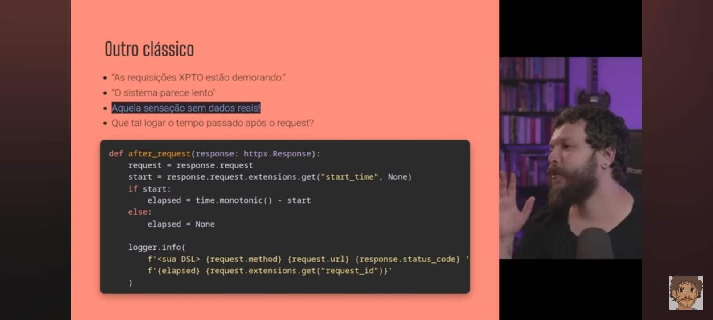
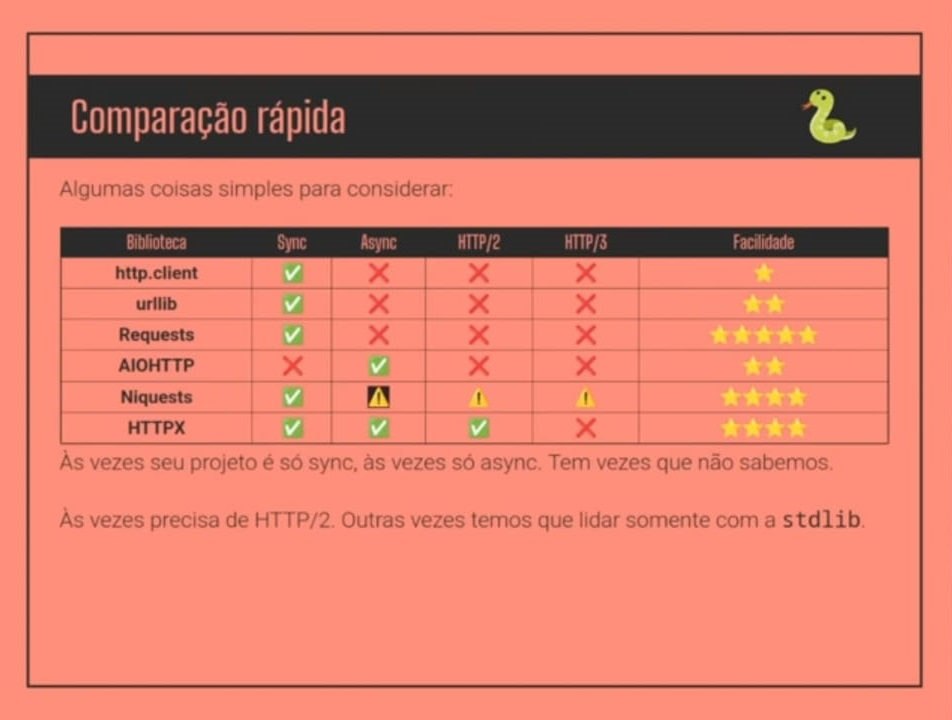

# HTTP (Hypertext Transfer Protocol)

HTTP é o protocolo de aplicação usado pela web para transportar recursos (HTML, JSON, imagens, etc.) entre clientes e servidores. É simples, textual e baseado em mensagens, com uma clara separação entre métodos, cabeçalhos e corpo.

Usar o retry

Usar o UIID para cada requisição

Calcular tempo de resposta de cada API

Cache

Cliente local ou global (conexões gastam recursos)

## Conceitos principais

- **Requests e Responses:** o cliente envia uma *request* (método, caminho, cabeçalhos, opcionalmente corpo). O servidor responde com uma *response* (código de status, cabeçalhos, corpo).
- **Métodos comuns:** `GET` (recuperar), `POST` (criar/submeter), `PUT`/`PATCH` (atualizar), `DELETE` (remover), `HEAD`, `OPTIONS`.
- **Códigos de status:** 1xx (informação), 2xx (sucesso), 3xx (redirecionamento), 4xx (erro do cliente), 5xx (erro do servidor).
- **Cabeçalhos:** metadata como `Content-Type`, `Accept`, `Authorization`, `Cache-Control`, `ETag`.

## HTTP vs HTTPS

HTTPS é HTTP sobre TLS/SSL — fornece confidencialidade, integridade e autenticação do servidor (e, opcionalmente, do cliente). Sempre usar HTTPS em produção para proteger dados em trânsito.

## Evolução: HTTP/1.1 → HTTP/2 → HTTP/3

- **HTTP/1.1:** textual, conexões persistentes, cabeçalhos repetitivos; sujeito a head-of-line blocking.
- **HTTP/2:** binary framing, multiplexação de streams sobre uma única conexão, compressão de cabeçalhos — melhora latência.
- **HTTP/3:** usa QUIC (sobre UDP) para reduzir latência de handshake e evitar head-of-line blocking a nível de transporte.

## Princípios REST e boas práticas

- Use métodos e códigos de status de forma semântica.
- Versionamento da API quando houver mudanças incompatíveis.
- Paginação, filtros e limites em endpoints que retornam coleções.
- Habilitar caching adequado (`Cache-Control`, `ETag`) para reduzir latência e carga.
- Tratar segurança: validação de entrada, proteção contra CSRF (quando aplicável), `Content-Security-Policy` e cabeçalhos seguros.

## Caching e performance

Cache-control, Expires e ETag permitem que clientes e proxies armazenem respostas e reduzam chamadas ao servidor. Use compressão (gzip/flatebrot) e recursos estáticos versionados para melhor performance.

## Exemplo visual — comparação de versões/protocolos

## Dicas rápidas para desenvolvedores Python

- Para requests HTTP cliente: use `requests` ou `httpx` (suporta async e HTTP/2).
- Para servidores: `Flask`, `FastAPI` ou `Django` (escolha conforme requisitos de desempenho e ecossistema).
- Teste endpoints com ferramentas como `curl`, `httpie` ou `Postman`.

Referências e leitura adicional: RFCs do HTTP, documentação do `requests`/`httpx` e guias sobre TLS/HTTPS.

